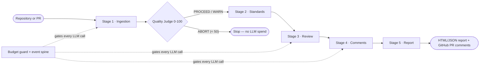
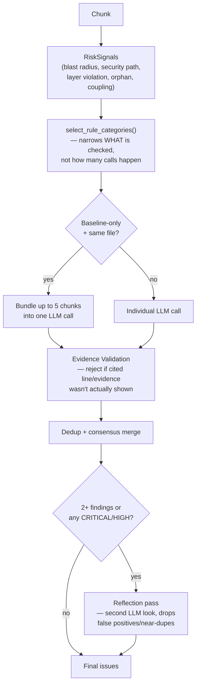
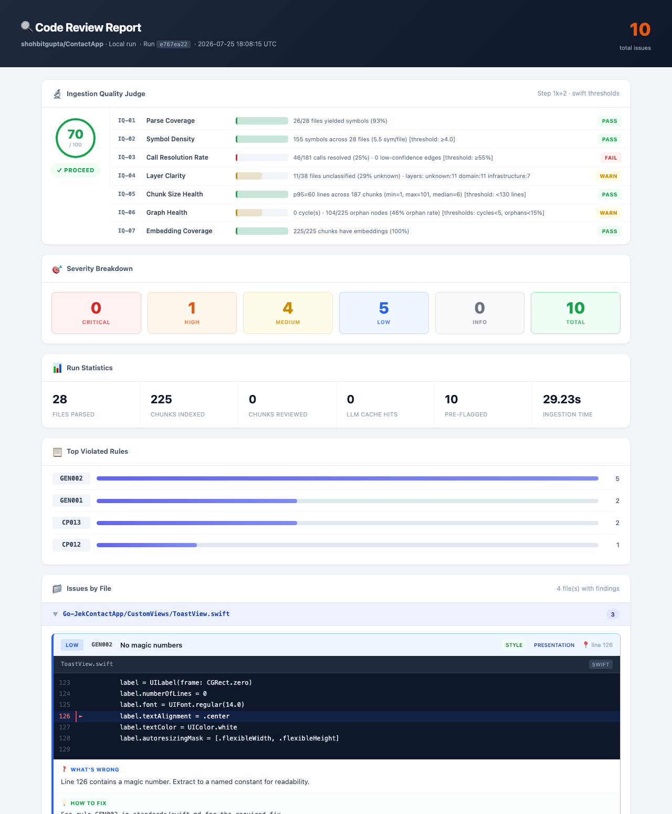

# Code Reviewer Agent

An AI-powered code review pipeline that parses a repository with real ASTs and tree-sitter grammars, builds a project-wide dependency graph, and scores its own ingestion quality **before** spending a single LLM call on review.

Five independent stages — ingestion, standards, review, comments, report — coordinated through one shared state object, no stage calling another directly. Every LLM finding is grounded against real citations, budget-guarded, and measured against a golden-dataset eval harness rather than trusted on faith.

 

---

## How it works



| Stage | Role |
|---|---|
| **1 · Ingestion** | Clone (diff-aware, content-hash-cached) → parse (AST / tree-sitter) → resolve cross-file symbols → classify architectural layers → chunk (deterministic IDs) → mechanical rule checks → summarize → build dependency graph → embed (dense + BM25) → score ingestion quality |
| **2 · Standards** | Load 73 coding-standard rules from `stage2_standards/rules/*.md` (general, security, architecture/SOLID, and one file per language) into structured `Rule` objects |
| **3 · Review** | Route each chunk by risk signal to a narrow rule-category set, bundle low-risk chunks to cut call count, run the LLM review, validate every finding's evidence against real context, deduplicate, then reflect |
| **4 · Comments** | Group nearby issues, budget volume per file, format per platform, polish CRITICAL/HIGH comments with an LLM pass |
| **5 · Report** | Build a self-contained HTML/JSON report and optionally post inline comments to the PR |

### Stage 3 internals — risk routing, grounding, and the second look



This is deliberately **narrow single-pass routing, not a multi-agent fan-out** — security/style/complexity/error-handling stay in every chunk's baseline rule set (no coverage regression), while architecture/performance/testing categories only get added when a chunk's own risk signals warrant them. Under a rate-limited provider, call *count* is the actual bottleneck, not worker concurrency — matching the production philosophy behind Alibaba's open-code-review, CodeRabbit, and Qodo/PR-Agent, all of which favor narrow single calls over broad specialist fan-out.

## Key features

- **Real parsing, not regex-on-diffs** — stdlib `ast` for Python; tree-sitter grammars for Kotlin, Rust, and Dart; a hand-written parser for Swift (the available `tree-sitter-swift` grammar package is too immature to rely on)
- **Project-wide dependency graph** — calls, imports, inheritance, and architectural layers (presentation/domain/data/infrastructure), multi-label for cross-cutting files
- **Ingestion Quality Gate** — 7 weighted, language-aware dimensions collapse into a 0–100 score; below 50, the LLM review is skipped entirely
- **Mechanical checks before any LLM call** — hardcoded secrets, function length, god classes, and more are caught deterministically, for free
- **Hybrid retrieval** — dense vector search (Qdrant) and BM25 lexical search fused with Reciprocal Rank Fusion for review context
- **Deterministic, genuinely incremental ingestion** — chunk IDs are derived (`uuid5`) from repo/path/symbol/line, not random, so Qdrant upserts, the parse cache, and the summary cache all correctly recognize unchanged content across separate runs of the same repo; diff-aware PR reviews scope this further to changed files only
- **Risk-based rule routing, not multi-agent fan-out** — `RiskSignals` (blast radius, security path, layer violation, orphan, coupling) narrow *which rule categories* a chunk is checked against; a fixed baseline (security/style/complexity/error-handling) is never dropped
- **File-bundling for throughput** — small, same-file, baseline-only-risk chunks are batched into one LLM call (up to 5 chunks / 200 lines) instead of one call each, since call *count* — not concurrency — is the real ceiling under a rate-limited provider
- **Evidence Validation + Reflection** — every finding's cited line and evidence must resolve to something actually shown in that call's context, or it's rejected outright (not silently clamped); a second LLM pass then re-examines the surviving findings for false positives and near-duplicates
- **Groundedness eval harness** (`tests/test_groundedness_eval.py`) — a 4-tier suite measuring whether findings are not just grounded but *factually correct*: precision/recall/F1 against a golden dataset, a grounding-integrity audit, an independent LLM-as-judge factual check (with a negative control), and adversarial false-positive traps
- **Budget guard + event spine** — hard per-run/rolling-daily USD ceilings enforced before every LLM call, plus an append-only JSONL log of every call's cost, tokens, and duration per run
- **Risk-tiered model selection** — security-sensitive code (auth/crypto/token paths) gets the strongest model; routine code gets a faster one
- **Provider-agnostic LLM client** — one interface over Anthropic, OpenAI, ZhipuAI GLM (free tier), and any OpenAI-SDK-compatible LiteLLM gateway, with independent `reviewer`/`judge` role model configs (`configs/model_config.json`)
- **Budgeted, platform-aware comments** — caps per-file/per-run volume, demotes overflow into a summary instead of dropping it; renders for GitHub, GitLab, Jira, or plain text
- **Basic web UI** (`webapp/app.py`) — a bare-minimum FastAPI wrapper for ad-hoc testing: paste a repo URL, trigger a review, watch status, open the HTML report

## Key architectural decisions

| Decision | Rationale |
|---|---|
| Append-only shared state | Stages never call each other directly — each reads keys it didn't write and writes keys nobody else will, so any stage is re-runnable in isolation |
| Quality gate before the expensive stage | An LLM review should never run against a badly-ingested repo and confidently report wrong findings |
| Deterministic checks before LLM calls | Cheaper, faster, and these findings survive even if the LLM is rate-limited or down |
| Hybrid retrieval, always fused | Dense embeddings miss exact identifier matches; BM25 recovers them — RRF merges both cheaply |
| Multi-label architectural layers | Cross-cutting bridge files (mappers, adapters) are legitimate — forcing one label would manufacture false layer-violation findings |
| Deterministic `chunk_id` (`uuid5`, not random) | It's the join key for Qdrant's incremental upsert, the parse cache, and the summary cache — a random ID would silently break all three across separate runs of the same repo |
| Narrow rule-category routing over specialist fan-out | Rate-limited providers are bottlenecked on call *count*, not concurrency — bundling and category-narrowing cut calls; a broad multi-agent fan-out would only add more of them |
| Evidence Validation as a hard gate, not a soft signal | A hallucination can be **coherently grounded** — a real line number and a real symbol name wrapped around a false conclusion. Checking a citation exists is necessary but not sufficient, so ungrounded findings are rejected outright, not down-weighted |
| Groundedness measured, not assumed | Grounding *mechanisms* (Evidence Validation, Reflection) don't prove the mechanisms — or the underlying model — are actually trustworthy at scale; the eval harness exists specifically to measure that, including a planted negative control the judge must catch |
| Provider-agnostic LLM client | Development runs free on a free-tier model or an internal LiteLLM gateway; production is a one-line swap to Anthropic or OpenAI |

## Tech stack

| Category | Technologies |
|---|---|
| Language & parsing | Python · stdlib `ast` · tree-sitter (Kotlin, Rust, Dart) · regex parser (Swift) |
| Search & retrieval | Qdrant (dense vectors) · custom BM25 (lexical) · Reciprocal Rank Fusion · NetworkX (dependency graph) |
| LLM layer | Anthropic Claude · OpenAI · ZhipuAI GLM (free tier) · any OpenAI-SDK-compatible LiteLLM gateway — via a provider-agnostic client with per-role (reviewer/judge) model config |
| Embeddings | Voyage AI (`voyage-code-3`, default) · OpenAI embeddings (alternative) |
| Eval / quality | `pytest`-driven golden-dataset harness · LLM-as-judge factual audit · deterministic evidence/grounding checks |
| Web UI & deploy | FastAPI · Uvicorn · Docker |
| Infra & integration | GitHub REST API · `concurrent.futures` thread pools · pickle-based caching · JSONL event log · local budget ledger · `python-dotenv` |

## Getting started

### Prerequisites

- Python 3.9+
- A Qdrant instance (local via Docker, or remote) — optional if running with `--skip-qdrant`
- An API key for at least one LLM provider — Anthropic, OpenAI, ZhipuAI's free tier, or an OpenAI-SDK-compatible LiteLLM gateway (the default)

### Installation

```bash
git clone https://github.com/shohbitgupta/code_reviewer_agent.git
cd code_reviewer_agent
pip install -r requirements.txt
```

### Configuration

Create a `.env` file in the project root (loaded automatically):

| Variable | Purpose | Default |
|---|---|---|
| `MODEL_TYPE` | `LITELLM` \| `FREE` \| `OPENAI` \| `ANTHROPIC` | `LITELLM` |
| `MODEL_NAME` / `FAST_MODEL_NAME` | Override the review / fast-tier model ID | provider default |
| `ANTHROPIC_API_KEY` / `OPENAI_API_KEY` / `ZHIPUAI_API_KEY` | Provider credentials — `OPENAI_API_KEY` also authenticates both `configs/model_config.json` roles under `MODEL_TYPE=LITELLM` | — |
| `LLM_API_KEY` | Universal fallback key | — |
| `LLM_BASE_URL` | Override base URL for OpenAI-compatible endpoints | — |
| `GITHUB_TOKEN` | Required for private repos and PR comment posting | — |
| `VOYAGE_API_KEY` | Embeddings (default backend) | — |
| `QDRANT_URL` / `QDRANT_API_KEY` | Vector store connection | `http://localhost:6333` |
| `MAX_REVIEW_CHUNKS` | Cap on chunks reviewed per run (`0` = no cap) | `300` |
| `MAX_REVIEW_COST_USD` | Hard USD ceiling per review run (`0` = disabled) | `0` |
| `DAILY_BUDGET_USD` | Rolling 24h USD ceiling across all runs (`0` = disabled) | `0` |

`MODEL_TYPE=LITELLM` routes the pipeline through `configs/model_config.json`'s `"reviewer"` entry — an OpenAI-SDK-compatible gateway (custom `base_url`, `OPENAI_API_KEY` for auth). That same file's `"judge"` entry is independent of `MODEL_TYPE`: the eval harness's Tier 3 judge always uses it directly, so it can run a different model than whichever one the pipeline under test is configured with.

### Usage

```bash
# Ingestion only — parse, chunk, graph, embed (no LLM review)
python main.py https://github.com/owner/repo

# Full 5-stage review, HTML report opened in browser
python main.py https://github.com/owner/repo --review --open

# Review a specific PR — diff-aware ingestion + inline GitHub comments
python main.py https://github.com/owner/repo --review --pr 42

# Dry run — no Qdrant, no LLM, no GitHub API
python main.py https://github.com/owner/repo --review --dry-run
```

| Flag | Effect |
|---|---|
| `--review` | Run all 5 stages instead of ingestion only |
| `--pr N` | Review PR `N`; enables diff-aware ingestion and comment posting |
| `--platform` | `github` \| `gitlab` \| `jira` \| `text` |
| `--dry-run` | Disable Qdrant, LLM, and GitHub calls together |
| `--skip-qdrant` / `--skip-summaries` / `--skip-review` / `--skip-posting` | Skip individual stages |
| `--open` | Open the HTML report when done |
| `-v`, `--verbose` | Debug-level logging |

### Web UI

A bare-minimum FastAPI wrapper around the same pipeline — paste a repo URL, trigger a review, poll status, open the HTML report. No auth, no persistent history; built for ad-hoc testing, not as a hosted service.

```bash
uvicorn webapp.app:app --reload --port 8000
# or, containerized:
docker build -t code-reviewer-agent . && docker run -p 8000:8000 --env-file .env code-reviewer-agent
```

If `MODEL_TYPE=LITELLM` points at an internal gateway, whatever host runs this (locally or in a container) needs actual network reachability to that endpoint — deploying to a public PaaS free tier does not, by itself, grant a route into a private/internal network.

### Eval suite

```bash
# Deterministic tiers only (no API key needed) — always safe to run
pytest tests/test_eval_golden.py tests/test_groundedness_eval.py -s -v

# With an LLM key configured: full Tier 1–4 groundedness run
# (precision/recall/F1, grounding audit, LLM-as-judge, adversarial traps)
pytest tests/test_groundedness_eval.py -s -v
```

## Sample output

A full run's HTML report — ingestion quality score, severity breakdown, and per-file issue cards with inline code context:



Reference copies: [`report.html`](docs/sample-report/report.html) · [`report.pdf`](docs/sample-report/report.pdf)

## Project structure

```
main.py                  CLI entry point
webapp/                  Bare-minimum FastAPI UI (repo URL in, HTML report out)
Dockerfile               Container build for the web UI
orchestration/           Pipeline runner + shared ReviewState contract
core/                    Global config, MODEL_TYPE routing, shared dataclasses
configs/                 model_config.json (reviewer/judge roles) + file-type map
stage1_ingestion/        Fetch → parse → resolve → chunk (deterministic IDs) → graph → embed → quality gate
stage2_standards/        Coding-standard rules (rules/*.md) → structured Rule objects
stage3_review/           Risk-based rule routing, bundling, LLM review, evidence validation, dedup, reflection
stage4_comments/         Grouping, budgeting, formatting, LLM polish
stage5_report/           Report generation + GitHub PR comment posting
tools/                   Stateless utilities — git, GitHub, LLM client, embeddings, Qdrant, BM25,
                         budget guard, event spine, cost estimation
skills/                  Design specs for each pipeline stage
docs/                    Reference diagrams and sample report
tests/                   Integration tests + eval harness (tests/eval/, tests/golden/)
workspace/               Per-run artifacts (gitignored)
```

## Current limitations

- Single-repo, single-process — no concurrent multi-repo orchestration
- Dependency graph is in-memory NetworkX persisted as JSON — fine at repo scale, not organization scale
- Manual trigger only — CLI or the bare-minimum web UI, no webhook or GitHub App integration yet
- Uneven parser depth — Swift falls back to a hand-written regex parser; the available `tree-sitter-swift` grammar package isn't production-ready
- File-based local caching — pickle-backed, doesn't survive across machines or workers
- No multi-tenancy or auth model — a single-operator tool; the web UI in particular has no auth, so anyone who reaches it can trigger (billable) LLM calls
- `MODEL_TYPE=LITELLM` requires actual network reachability to whatever gateway `configs/model_config.json` points at — a custom/internal endpoint won't resolve from an arbitrary hosting environment without a real route (e.g. VPN) into that network
- Eval harness's Tier 1/3/4 need a live LLM call — no offline/deterministic substitute for measuring real review or judge quality

## Roadmap

- Replace the in-memory dependency graph with a real graph database for many repos at once
- Move from a sequential thread-pool pipeline to a distributed task queue
- Add a GitHub App / webhook layer to trigger reviews on PR events automatically
- Shared, clustered caching and vector storage for safe parallel execution
- Richer observability — the event spine + budget ledger cover per-call cost/usage today; still missing distributed tracing and dashboards
- Harden for multi-tenancy — isolated workspaces, secrets management, per-org rate limits, and auth on the web UI

## License

MIT — see [LICENSE](LICENSE).
