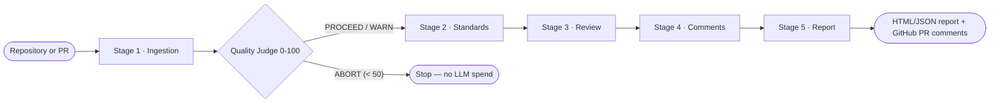

# Code Reviewer Agent

An AI-powered code review pipeline that parses a repository with real ASTs and tree-sitter grammars, builds a project-wide dependency graph, and scores its own ingestion quality **before** spending a single LLM call on review.

Five independent stages — ingestion, standards, review, comments, report — coordinated through one shared state object, no stage calling another directly.

 

---

## How it works



| Stage | Role |
|---|---|
| **1 · Ingestion** | Clone → parse (AST / tree-sitter) → resolve cross-file symbols → classify architectural layers → chunk → mechanical rule checks → summarize → build dependency graph → embed (dense + BM25) → score ingestion quality |
| **2 · Standards** | Load coding-standard rules from `stage2_standards/rules/*.md`, one file per language, into structured `Rule` objects |
| **3 · Review** | Select and tier chunks by risk, retrieve hybrid context (dense + lexical), run the LLM review, deduplicate findings |
| **4 · Comments** | Group nearby issues, budget volume per file, format per platform, polish CRITICAL/HIGH comments with an LLM pass |
| **5 · Report** | Build a self-contained HTML/JSON report and optionally post inline comments to the PR |

## Key features

- **Real parsing, not regex-on-diffs** — stdlib `ast` for Python, tree-sitter grammars for Kotlin/Rust, hand-written parsers for Swift/Dart
- **Project-wide dependency graph** — calls, imports, inheritance, and architectural layers (presentation/domain/data/infrastructure), multi-label for cross-cutting files
- **Ingestion Quality Gate** — 7 weighted, language-aware dimensions collapse into a 0–100 score; below 50, the LLM review is skipped entirely
- **Mechanical checks before any LLM call** — hardcoded secrets, function length, god classes, and more are caught deterministically, for free
- **Hybrid retrieval** — dense vector search (Qdrant) and BM25 lexical search fused with Reciprocal Rank Fusion for review context
- **Risk-tiered model selection** — security-sensitive code (auth/crypto/token paths) gets the strongest model; routine code gets a faster one
- **Provider-agnostic LLM client** — one interface over Anthropic, OpenAI, and a free tier (ZhipuAI GLM)
- **Diff-aware, incremental ingestion** — content-hash-gated vector upserts and changed-file scoping keep re-runs cheap
- **Budgeted, platform-aware comments** — caps per-file/per-run volume, demotes overflow into a summary instead of dropping it; renders for GitHub, GitLab, Jira, or plain text

## Key architectural decisions

| Decision | Rationale |
|---|---|
| Append-only shared state | Stages never call each other directly — each reads keys it didn't write and writes keys nobody else will, so any stage is re-runnable in isolation |
| Quality gate before the expensive stage | An LLM review should never run against a badly-ingested repo and confidently report wrong findings |
| Deterministic checks before LLM calls | Cheaper, faster, and these findings survive even if the LLM is rate-limited or down |
| Hybrid retrieval, always fused | Dense embeddings miss exact identifier matches; BM25 recovers them — RRF merges both cheaply |
| Multi-label architectural layers | Cross-cutting bridge files (mappers, adapters) are legitimate — forcing one label would manufacture false layer-violation findings |
| Provider-agnostic LLM client | Development runs free on a free-tier model; production is a one-line swap to Anthropic or OpenAI |

## Tech stack

| Category | Technologies |
|---|---|
| Language & parsing | Python · stdlib `ast` · tree-sitter (Kotlin, Rust) · regex parsers (Swift, Dart) |
| Search & retrieval | Qdrant (dense vectors) · custom BM25 (lexical) · Reciprocal Rank Fusion · NetworkX (dependency graph) |
| LLM layer | Anthropic Claude · OpenAI · ZhipuAI GLM (free tier) — via a provider-agnostic client |
| Embeddings | Voyage AI (`voyage-code-3`, default) · OpenAI embeddings (alternative) |
| Infra & integration | GitHub REST API · `concurrent.futures` thread pools · pickle-based caching · `python-dotenv` |

## Getting started

### Prerequisites

- Python 3.9+
- A Qdrant instance (local via Docker, or remote) — optional if running with `--skip-qdrant`
- An API key for at least one LLM provider (Anthropic, OpenAI, or ZhipuAI's free tier)

### Installation

```bash
git clone https://github.com/shohbitgupta/code_reviewer_agent.git
cd code_reviewer_agent
pip install -r requirements.txt
```

### Configuration

Create a `.env` file in the project root (loaded automatically):

| Variable | Purpose | Default |
|---|---|---|
| `MODEL_TYPE` | `FREE` \| `OPENAI` \| `ANTHROPIC` | `ANTHROPIC` |
| `MODEL_NAME` / `FAST_MODEL_NAME` | Override the review / fast-tier model ID | provider default |
| `ANTHROPIC_API_KEY` / `OPENAI_API_KEY` / `ZHIPUAI_API_KEY` | Provider credentials | — |
| `LLM_API_KEY` | Universal fallback key | — |
| `LLM_BASE_URL` | Override base URL for OpenAI-compatible endpoints | — |
| `GITHUB_TOKEN` | Required for private repos and PR comment posting | — |
| `VOYAGE_API_KEY` | Embeddings (default backend) | — |
| `QDRANT_URL` / `QDRANT_API_KEY` | Vector store connection | `http://localhost:6333` |
| `MAX_REVIEW_CHUNKS` | Cap on chunks reviewed per run (`0` = no cap) | `300` |

### Usage

```bash
# Ingestion only — parse, chunk, graph, embed (no LLM review)
python main.py https://github.com/owner/repo

# Full 5-stage review, HTML report opened in browser
python main.py https://github.com/owner/repo --review --open

# Review a specific PR — diff-aware ingestion + inline GitHub comments
python main.py https://github.com/owner/repo --review --pr 42

# Dry run — no Qdrant, no LLM, no GitHub API
python main.py https://github.com/owner/repo --review --dry-run
```

| Flag | Effect |
|---|---|
| `--review` | Run all 5 stages instead of ingestion only |
| `--pr N` | Review PR `N`; enables diff-aware ingestion and comment posting |
| `--platform` | `github` \| `gitlab` \| `jira` \| `text` |
| `--dry-run` | Disable Qdrant, LLM, and GitHub calls together |
| `--skip-qdrant` / `--skip-summaries` / `--skip-review` / `--skip-posting` | Skip individual stages |
| `--open` | Open the HTML report when done |
| `-v`, `--verbose` | Debug-level logging |

## Sample output

A full run's HTML report — ingestion quality score, severity breakdown, and per-file issue cards with inline code context:


Reference copies: [`report.html`](docs/sample-report/report.html) · [`report.pdf`](docs/sample-report/report.pdf)

## Project structure

```
main.py               CLI entry point
orchestration/        Pipeline runner + shared ReviewState contract
core/                 Global config and shared dataclasses
stage1_ingestion/      Fetch → parse → resolve → chunk → graph → embed → quality gate
stage2_standards/      Coding-standard rules (rules/*.md) → structured Rule objects
stage3_review/         Chunk selection, hybrid retrieval, LLM review, deduplication
stage4_comments/       Grouping, budgeting, formatting, LLM polish
stage5_report/         Report generation + GitHub PR comment posting
tools/                 Stateless shared utilities (git, GitHub, LLM client, embeddings, Qdrant, BM25)
skills/                Design specs for each pipeline stage
docs/                  Reference diagrams and sample report
tests/                 Integration tests
workspace/             Per-run artifacts (gitignored)
```

## Current limitations

- Single-repo, single-process — no concurrent multi-repo orchestration
- Dependency graph is in-memory NetworkX persisted as JSON — fine at repo scale, not organization scale
- Manual trigger only — invoked via CLI, no webhook or GitHub App integration yet
- Uneven parser depth — only Kotlin and Rust use full tree-sitter grammars
- File-based local caching — pickle-backed, doesn't survive across machines or workers
- No multi-tenancy or auth model — a single-operator tool, not a hosted service

## Roadmap

- Replace the in-memory dependency graph with a real graph database for many repos at once
- Move from a sequential thread-pool pipeline to a distributed task queue
- Add a GitHub App / webhook layer to trigger reviews on PR events automatically
- Shared, clustered caching and vector storage for safe parallel execution
- Per-stage observability — metrics and tracing, not just structured logs
- Harden for multi-tenancy — isolated workspaces, secrets management, per-org rate limits

## License

MIT — see [LICENSE](LICENSE).
